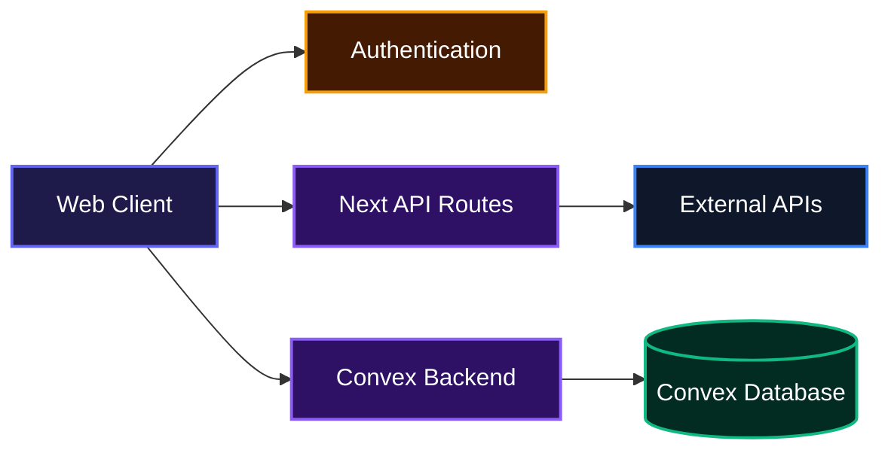
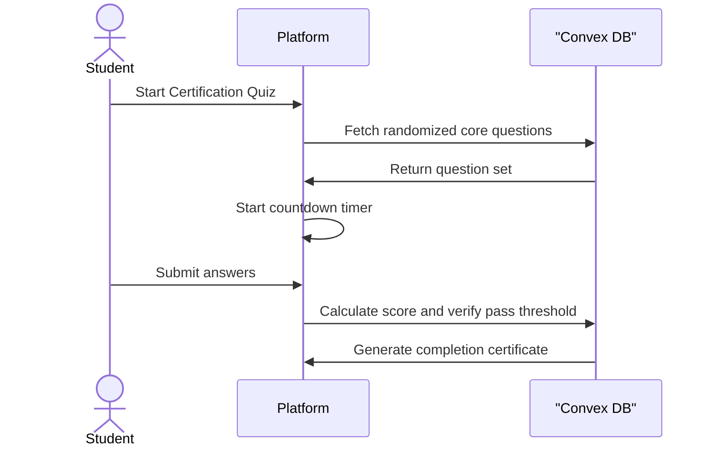

# Quizora

Quizora helps students and developers structure their learning by turning video courses into interactive practice sessions. It takes video lessons and pairs them with auto-graded quizzes, allowing users to track their progress, test their knowledge, and earn completion certificates.

## System Architecture



## Description

A learning platform that allows students to watch curated video playlists and immediately test their understanding. The application features timed certification quizzes, a global leaderboard, and an administrative dashboard for managing course catalogs and question banks.

## Installation

Follow these steps to set up the project locally:

* Clone the Repository:
```bash
git clone https://github.com/EbubeStrong/e-learning platform
```

* Install dependencies:
```bash
npm install
```

* Set up environment variables by creating a `.env.local` file in the root directory and adding the required keys:
```env
NEXT_PUBLIC_CLERK_PUBLISHABLE_KEY=your_clerk_pub_key
CLERK_SECRET_KEY=your_clerk_secret_key
CONVEX_DEPLOYMENT=your_convex_deployment
NEXT_PUBLIC_CONVEX_URL=your_convex_url
RESEND_API_KEY=your_resend_api_key
CONTACT_RECIPIENT_EMAIL=you@example.com
NEXT_PUBLIC_ADMIN_EMAILS=admin@example.com
```

* Start the development server:
```bash
npm run dev
```

## Usage

After starting the server, open your browser and navigate to `http://localhost:3000`. You can browse available courses without an account, but you must sign in to take quizzes and save your video progress.

To manage the platform, users with the admin role can navigate to `/admin`. From the admin dashboard, you can click "Seed database" to populate the platform with default courses and questions.

## Features

* **Interactive Video Learning**: Watch course playlists directly on the platform with automatic progress tracking and resume functionality.
* **Certification Engine**: Take timed or untimed multiple-choice quizzes. The platform tracks your attempts and calculates scores automatically.



* **Admin Dashboard**: Manage the course inventory, visualize category distributions, and curate the question bank.
* **Global Leaderboard**: Compare your certification scores and total attempt counts against other learners on the platform.

## Technologies Used

* TypeScript
* React
* Next.js
* Convex
* Tailwind CSS
* Clerk
* Resend
* ApexCharts

## API Documentation

The project exposes standard REST endpoints via Next.js Route Handlers to integrate external catalog data and handle communications.

#### GET /api/courses
**Description**: Fetches the list of all available courses, including metadata from the YouTube catalog.

**Request**:
```bash
curl http://localhost:3000/api/courses
```

**Response**:
```json
{
  "courses": [
    {
      "id": "web-development",
      "playlistId": "PLxyz...",
      "title": "Introduction to Web Development",
      "category": "Web Development",
      "level": "Beginner",
      "imageAlt": "Course artwork",
      "videoCount": 12,
      "thumbnail": "https://...",
      "playlistUrl": "https://...",
      "tutor": {
        "id": "author123",
        "displayName": "John Doe",
        "avatar": "https://..."
      }
    }
  ]
}
```

#### GET /api/courses/[courseId]
**Description**: Retrieves the full details for a specific course, including its video curriculum.

**Request**:
```bash
curl http://localhost:3000/api/courses/web-development
```

**Response**:
```json
{
  "course": {
    "id": "web-development",
    "playlistId": "PLxyz...",
    "title": "Introduction to Web Development",
    "category": "Web Development",
    "level": "Beginner",
    "imageAlt": "Course artwork",
    "playlistUrl": "https://...",
    "thumbnail": "https://..."
  },
  "videos": [
    {
      "videoId": "abc123xyz",
      "title": "Lesson 1: HTML Basics",
      "duration": "10:05",
      "description": "An introduction to HTML.",
      "thumbnail": "https://..."
    }
  ],
  "total": 1,
  "tutor": {
    "id": "author123",
    "displayName": "John Doe",
    "avatar": "https://..."
  }
}
```

**Errors**:
* 404: Course not found.

#### GET /api/tutors
**Description**: Fetches information about a specific course author or tutor.

**Request**:
```bash
curl "http://localhost:3000/api/tutors?id=author123"
```

**Response**:
```json
{
  "tutor": {
    "id": "author123",
    "displayName": "John Doe",
    "jobTitle": "Senior Developer",
    "avatar": "https://..."
  }
}
```

**Errors**:
* 400: Missing author id.

#### POST /api/contact
**Description**: Submits a contact form message and sends an email via Resend to the configured admin email addresses.

**Request**:
```json
{
  "name": "Jane Doe",
  "email": "jane@example.com",
  "message": "I have a question about the platform.",
  "website": "" 
}
```

**Response**:
```json
{
  "ok": true
}
```

**Errors**:
* 400: Bad request or validation failure.
* 500: Mail is not configured on the server or something went wrong.

## Author Info

* LinkedIn: https://linkedin.com/in/AbrahamSamuel567
* X: https://x.com/ebubestrong21

---

[](https://www.typescriptlang.org/)
[](https://reactjs.org/)
[](https://nextjs.org/)
[](https://tailwindcss.com/)